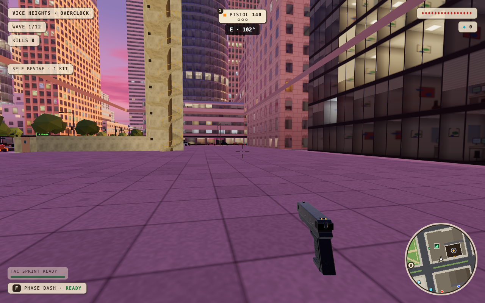
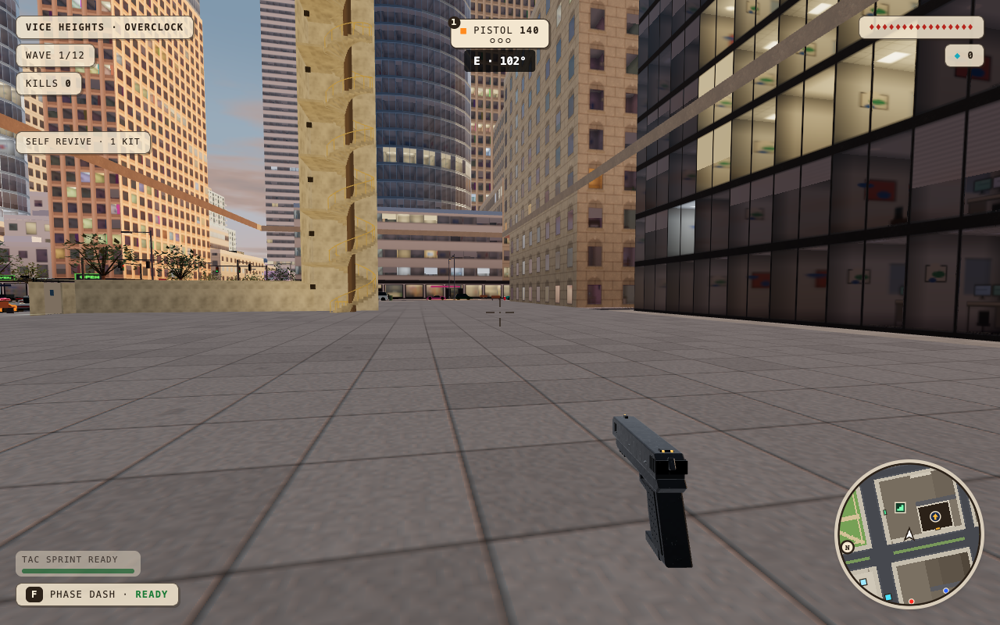
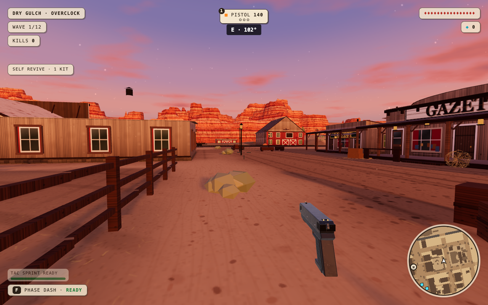
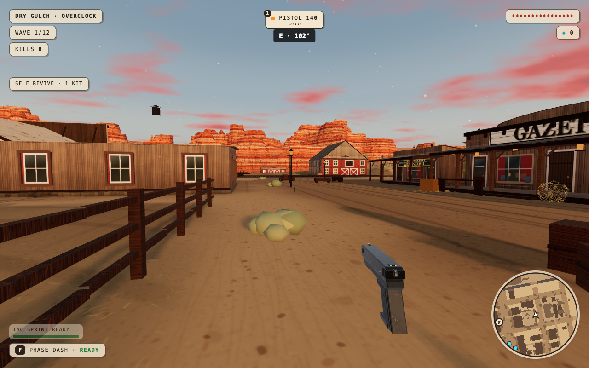
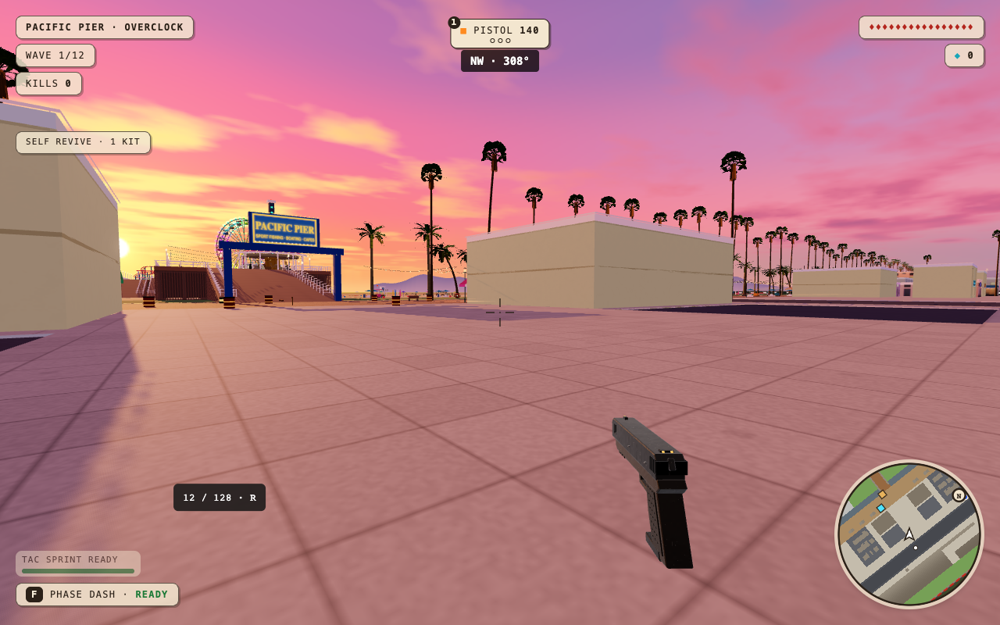
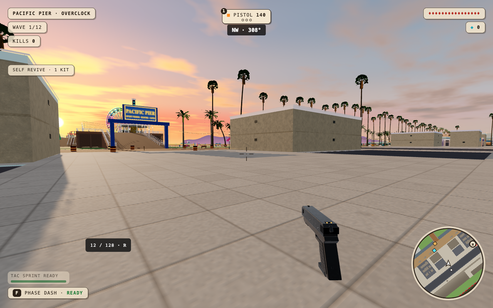
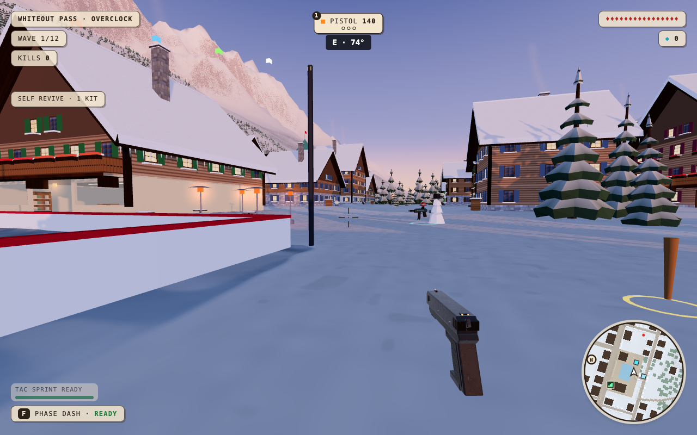
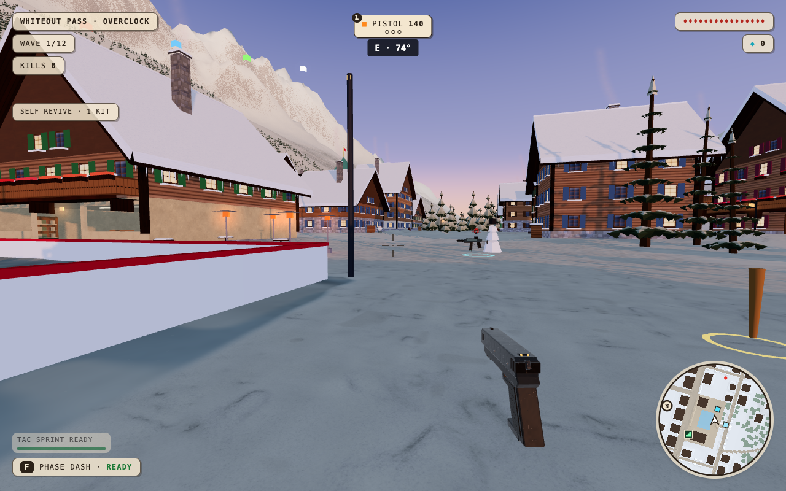

# Four-map realism pass

The target is more lifelike places: natural foliage, textured building surfaces, grounded construction, and less saturated light. The map layouts, game rules, and weapons stay the same.

## Changes

- Vice Heights: branch-and-leaf street trees, neutral sky fill, concrete grain and surface relief. The skyline keeps its sunset color while shaded streets lose the pink cast.
- Pacific Pier: natural tree crowns, smoother scrub, separate sand and boardwalk materials, concrete grain, and less saturated light.
- Dry Gulch: scanned timber and sand detail, fainter ground impressions, rooted shrubs with softer shading, and balanced desert light.
- Whiteout: open spruce boughs with snow on each branch, scanned snow and timber, stone church supports, sills, and gutters.
- Usable buildings: wall grain, small edge bevels, service grilles, and less self-light. Static room geometry reuses identical vertices. No door or window openings are filled.
- Nuketown: production builds reject its name, index, and shared room seed. The production bundle excludes the Nuketown scene. Development rooms have a separate connection namespace; development access remains. Map indices are unchanged. Room protocol advances to v18 so builds with different world rules cannot join each other.

## Assets and rendering

The four original 1K surface scans total 2.20 MB and load from the game's own host. [Source records and CC0 license](../../art/material-sources.md). Windows, signs, metal, and painted game markers retain their materials. Fine scan detail fades from 55 to 110 metres; low quality skips surface relief. Foliage and architectural details stay in the existing draw batches. Distant coastal hills use compact crowns, and detailed spruce boughs draw within 80 metres.

## Validation

Baseline: clean `origin/main` at `3810afe3e80d3fd422e671c444f335cc3d8c0a5e`. Its 67 built assets match the saved release worktree build byte for byte. The production service generated different asset names; local baseline identity was verified from the clean source build.

Visual checks use seed 7, night and sunset, three deterministic random walkable positions per map, and a 1.6 m eye height. Matching before/after captures are included below. The game was also inspected at each map's starting point. Browser plugin control was unavailable, so checks use the repository's Playwright installation and Chromium's Metal backend.

Performance checks alternate main and candidate, with vsync and the frame limit disabled. They measure frame p95/p99, callback CPU time, frames above 25/50 ms, and all render passes. A separate run applies a 4× CPU slowdown. These short local diagnostics do not prove phone FPS or long-session behavior.

Automated checks: 54 tests, typecheck, production build, repository-map coverage, and eight night/sunset scene entries pass. The final rendering adjustment has also passed typecheck, build, and all eight scene entries. Gameplay checks cover reload, ammo purchase, melee, driving/destruction, subway travel, overtime shop, Whiteout traversal, safe recovery, skiing, and shared lifts. Co-op preserves wave 5 after host departure and accepts a fresh guest. Both Nuketown URL forms reject the development map. Four 844×390 low-quality views load without browser errors. These are browser viewport checks, not a physical phone test.

[Baseline asset identity](baseline-proof.json) · [Nominal measurements](nominal.json) · [Co-op](coop.json) · [Public map access](public-access.json) · [Small viewport](small-screen.json)

## Measured rendering cost

These are 8-second environment diagnostics at 1280×800, high quality, with the same random camera pose. Times are milliseconds. Small differences include normal run-to-run variation.

| Map | Frame p95, main → candidate | 4× CPU frame p95, main → candidate | 4× callback CPU per frame, main → candidate |
| --- | --- | --- | --- |
| Vice Heights | 2.9 → 3.3 | 11.4 → 11.0 | 8.21 → 7.77 |
| Dry Gulch | 3.3 → 3.3 | 8.9 → 8.9 | 6.05 → 5.60 |
| Pacific Pier | 2.7 → 2.8 | 8.1 → 7.8 | 5.34 → 5.19 |
| Whiteout | 3.9 → 4.0 | 5.6 → 5.4 | 3.21 → 2.98 |

The new detail adds up to 0.4 ms to nominal p95 in this sample. The CPU-pressure run retains headroom, with no increase in the measured p95. Draw calls are unchanged in the nominal comparison: 177, 100, 106, and 64. This is not a claim that the game is faster on all devices. The reports include p99 and every >25/>50 ms frame count. [CPU-pressure report](cpu-pressure.json).

The production Nuketown change is being split into its own release. The art pass remains unmerged for visual review.

## Player-height comparisons

Each pair uses the same seed, position, and facing from the deterministic random walkable sample. These include ordinary building backs and side streets.


### Vice Heights

Before:



After:



### Dry Gulch

Before:



After:



### Pacific Pier

Before:



After:



### Whiteout Pass

Before:



After:



## Reproduce

Serve a clean main build and the candidate on separate local ports, then run:

```sh
BASELINE_URL=http://127.0.0.1:5188 CANDIDATE_URL=http://127.0.0.1:5186 TIMES=sunset node docs/qa/four-map-realism/audit.mjs
BASELINE_URL=http://127.0.0.1:5188 CANDIDATE_URL=http://127.0.0.1:5186 TIMES=sunset THROTTLE=4 node docs/qa/four-map-realism/audit.mjs
```

The script defaults to `/tmp/scrapfall-environment-audit`. `cpuMean` is mean requestAnimationFrame callback cost. `cpuPerFrame`, when present, sums callback time per measured frame; it is the CPU frame-cost comparison. Full render-pass counters include shadows and post effects.
