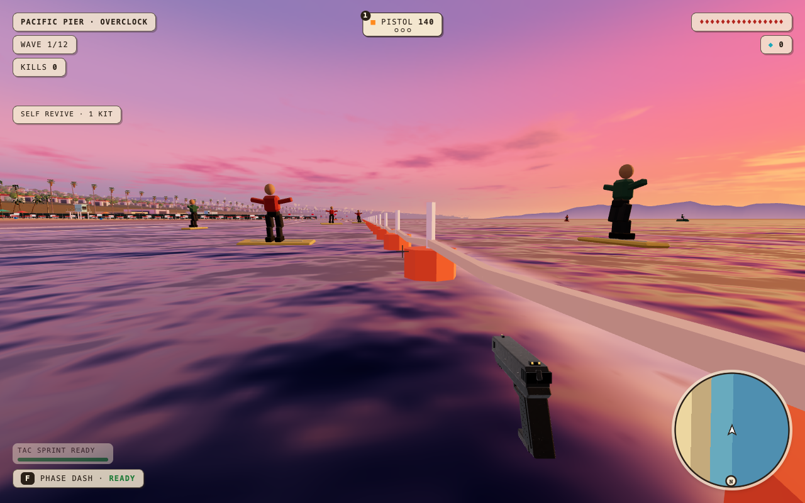

# Pier and Whiteout doorway verification

Final integration baseline: `main` at `4e5da66`; candidate source after merging it: `5f4465c` (`routes-DuC1F7LO.js`). The before screenshots and obstruction reproduction use the earlier `27e7284` build. Tested at 1280 x 800 on this Mac, with seed 11 unless stated otherwise.

## Reproduce the complete walking audit

```sh
npm ci
PLAYWRIGHT_SKIP_BROWSER_GC=1 npx playwright install chromium
npm run build
npm run serve:static
# In a second terminal:
SEEDS=1,4,7,11,42 node scripts/audit-pier-alpine-doors.mjs
```

Reports and screenshots default to `/tmp/scrapfall-door-audit`. `ENGINE=webkit` uses an installed Playwright WebKit browser. `WEATHER=night`, `PICK`, `SEEDS`, `OFFSETS` and `MAPS` can narrow a replay. Keep the default offsets to test the middle and both shoulders of each opening.

The test places the player **outside** each door at the real terrain height, then uses KeyW to cross 1.1 m inside and return 3.5 m outside. It never presses jump or bypasses world collision. Diagnostic steering points toward the destination; invulnerability and frozen enemies isolate traversal from combat. Inventory guards prevent missing rooms from producing a vacuous pass.

## Results

| Seed | Pier round trips | Whiteout round trips | Pier water-limit checks |
| --- | ---: | ---: | ---: |
| 1 | 30 | 36 | 1 |
| 4 | 27 | 33 | 1 |
| 7 | 27 | 33 | 1 |
| 11 | 27 | 36 | 1 |
| 42 | 27 | 33 | 1 |
| Total | 138 | 171 | 5 |

**309/309 door round trips and 5/5 boundary probes passed**, with zero jump inputs and browser errors. The [compact report](walking-summary.json) records per-map counts. The complete audit was repeated after merging current main, including its performance and menu changes. All 27 targeted night crossings also passed in WebKit on that final build. Earlier targeted sunset/night replays passed as well.

The same harness on the baseline reproduces the seed-4 surf-shop entrance obstruction and arcade exit obstruction. Whiteout's baseline centre routes already passed: the change reduces the steep approach, and the terrain profile audit measures that improvement; it does not claim a reproduced hard stop on every Whiteout doorway.

## Same player-eye surf-shop view, seed 4, sunset

| Before | After |
| --- | --- |
|  |  |

## Visible water boundary



## Additional coverage

- Ten generated Pier layouts (five seeds, solo and co-op): no booth canopy or loose prop overlaps a reserved front approach.
- 114 Whiteout door profiles across five seeds and both modes: worst floor gap 0.4 m outside fell from 0.1792 m to 0.0800 m; worst access gap 1.25 m outside fell from 0.3900 m to 0.1592 m.
- The apron leaves all 2,985 protected creek-bank vertices unchanged in every tested layout. The rendered and walked heightfield is the same.
- Real PeerJS host/guest sessions on Pier and Whiteout: identical generated room/threshold geometry, both players' movement synchronized, connected after 26 seconds, zero console errors. Rooms use v9 so older layouts cannot join.
- Buoys and the visible rope share one spacing function; floats are 4 m apart except under the amusement deck. Actual movement stops at the existing deep-water boundary and can travel alongside it.

## Required local checks

`npm run check` passed: 11 unit tests, TypeScript, production build, and all ten map/time smoke cases with zero errors. The repo-map and whitespace checks also passed. A full source-file fingerprint confirmed that the final build uses the same game source as the 309-round-trip audit (`routes-DuC1F7LO.js`).

Real co-op was repeated on the updated build, with session duration of 26 seconds on each map. Both players moved initially and after the heartbeat window, with zero measured remote-position error at the settled samples.

## Current-main performance comparison

Baseline `4e5da66` (`routes-Cro2rFLx.js`) and the updated candidate (`routes-DuC1F7LO.js`), seed 11, HIGH, 1280 x 800. Two six-second fixed-pose samples per build in alternating order; combat isolated, identical quality and pose, no other QA browsers from this session running. Chromium is uncapped, with a separate 4x CPU run. WebKit uses DPR 2 and night; Chromium uses DPR 1 and sunset. These are elapsed RAF callback times, not OS CPU counters.

| Map / engine | Mean callback ms, before → after | Worst p99 frame ms, before → after | Frames >50 ms, before → after |
| --- | ---: | ---: | ---: |
| Pier / Chromium | 1.83 → 2.04 | 9.6 → 7.2 | 0 → 0 |
| Whiteout / Chromium | 3.35 → 3.49 | 12.6 → 13.3 | 0 → 0 |
| Pier / Chromium 4x | 10.33 → 13.21 | 47.1 → 46.2 | 3 → 1 |
| Whiteout / Chromium 4x | 5.45 → 5.40 | 14.2 → 13.6 | 0 → 0 |
| Pier / WebKit | 2.30 → 2.26 | 36 → 36 | 0 → 0 |
| Whiteout / WebKit | 1.84 → 1.78 | 37 → 36 | 0 → 0 |

Draw calls match in every corresponding sample (sunset Pier 122 / Whiteout 105; night 119 / 103). Pier gains about 1.5% visible triangles from closer buoys and shaped boards; Whiteout geometry is effectively unchanged. Normal Chromium has zero >25 ms frames. WebKit cadence is 30 fps in both builds on this shared Mac, with identical >25 ms counts; this is not a 60 fps claim.

The initial 4x Pier comparison is noisy: baseline callbacks range 7.59–13.06 ms while candidate ranges 12.95–13.47 ms. The worst frame tails are similar, but the average alone does not establish parity. All samples are retained; the focused repeat is documented below.

[Summary](performance-summary.json), [Chromium](current-chromium-1.json), [CPU-pressure](current-chromium-4.json), [WebKit](current-webkit-1.json). Earlier comparisons against 27e7284 remain in local task evidence; they are superseded for current-main integration, not silently discarded.

The [six-sample focused repeat](current-chromium-4-confirm.json) also varies widely (baseline 5.39–9.02 ms, candidate 5.30–19.73 ms); the last matched pair is 5.39 → 5.30 ms. The [longer confirmation](current-chromium-4-long.json) uses two 30-second samples per build in baseline/candidate/candidate/baseline order. Mean callbacks are **6.05 → 6.18 ms**, worst p99 **14.0 → 14.8 ms**, frames >25 ms **1 → 2**, and frames >50 ms **0 → 0**. Draw calls match at 122.02. This supports comparable steady-state headroom for the added visible geometry on this machine; it does not erase the earlier short-run variability or guarantee performance on every device.

## Limits

No physical phone/controller test or full combat endurance run is claimed. The sparse ordinary-shop centrepiece is unchanged: its canonical furnishing plan is in `structures/`, outside this PR's assigned area. Surfboard silhouettes/fins and thinner hotel-lounge books are included. Performance measurements are reported in the PR separately from traversal checks.
