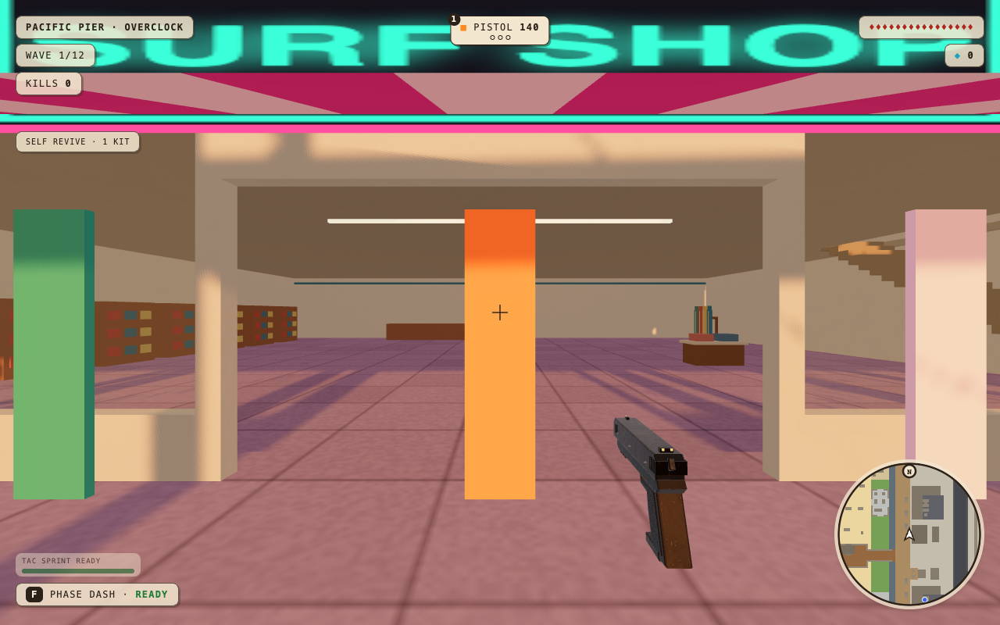
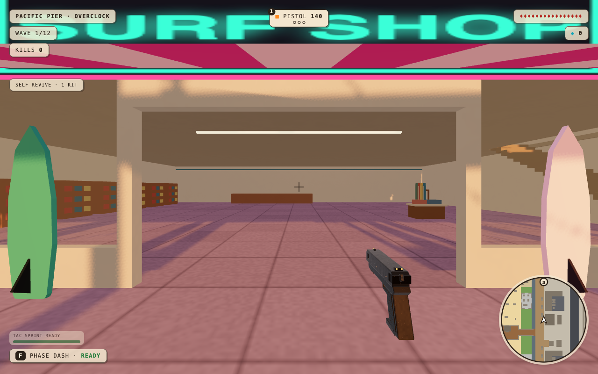

# Pier and Whiteout doorway verification

Baseline: `main` at `27e7284`. Candidate: the source in this PR. Tested at 1280 x 800 on this Mac, with seed 11 unless stated otherwise.

## Reproduce the complete walking audit

```sh
npm ci
npx playwright install chromium
npm run build
npm run serve:static
# In a second terminal:
SEEDS=1,4,7,11,42 node scripts/audit-pier-alpine-doors.mjs
```

Reports and screenshots default to `/tmp/scrapfall-door-audit`. `ENGINE=webkit` uses an installed Playwright WebKit browser. `WEATHER=night`, `PICK`, `SEEDS`, `OFFSETS` and `MAPS` can narrow a replay. Keep the default offsets to test the middle and both shoulders of each opening.

The test places the player **outside** each door at the real terrain height, then uses KeyW to cross 1.1 m inside and return 3.5 m outside. It never presses jump or bypasses world collision. Diagnostic steering points toward the destination; invulnerability and frozen enemies isolate traversal from combat. Inventory guards prevent missing rooms from producing a vacuous pass.

## Results

| Seed | Pier round trips | Whiteout round trips | Pier water-limit checks |
| --- | ---: | ---: | ---: |
| 1 | 30 | 36 | 1 |
| 4 | 27 | 33 | 1 |
| 7 | 27 | 33 | 1 |
| 11 | 27 | 36 | 1 |
| 42 | 27 | 33 | 1 |
| Total | 138 | 171 | 5 |

**309/309 door round trips and 5/5 boundary probes passed**, with zero jump inputs and browser errors. The [compact report](walking-summary.json) records per-map counts. Targeted sunset and night replays of the reported doors passed; the same targeted night replay also passed in WebKit.

The same harness on the baseline reproduces the seed-4 surf-shop entrance obstruction and arcade exit obstruction. Whiteout's baseline centre routes already passed: the change reduces the steep approach, and the terrain profile audit measures that improvement; it does not claim a reproduced hard stop on every Whiteout doorway.

## Same player-eye surf-shop view, seed 4, sunset

| Before | After |
| --- | --- |
|  |  |

## Additional coverage

- Ten generated Pier layouts (five seeds, solo and co-op): no booth canopy or loose prop overlaps a reserved front approach.
- 114 Whiteout door profiles across five seeds and both modes: worst floor gap 0.4 m outside fell from 0.1792 m to 0.0800 m; worst access gap 1.25 m outside fell from 0.3900 m to 0.1592 m.
- The apron leaves all 2,985 protected creek-bank vertices unchanged in every tested layout. The rendered and walked heightfield is the same.
- Real PeerJS host/guest sessions on Pier and Whiteout: identical generated room/threshold geometry, both players' movement synchronized, connected after 26 seconds, zero console errors. Rooms use v9 so older layouts cannot join.
- Buoys and the visible rope share one spacing function; floats are 4 m apart except under the amusement deck. Actual movement stops at the existing deep-water boundary and can travel alongside it.

## Required local checks

`npm run check` passed: 11 unit tests, TypeScript, production build, and all ten map/time smoke cases with zero errors. The repo-map and whitespace checks also passed. A full source-file fingerprint confirmed that the final build uses the same game source as the 309-round-trip audit (`routes-8PBZRLIO.js`).

Real co-op session duration was 26 seconds on each map. Both players moved initially and after the heartbeat window, with zero measured remote-position error at the settled samples.

## Limits

No physical phone/controller test or full combat endurance run is claimed. The sparse ordinary-shop centrepiece is unchanged: its canonical furnishing plan is in `structures/`, outside this PR's assigned area. Surfboard silhouettes/fins and thinner hotel-lounge books are included. Performance measurements are reported in the PR separately from traversal checks.
