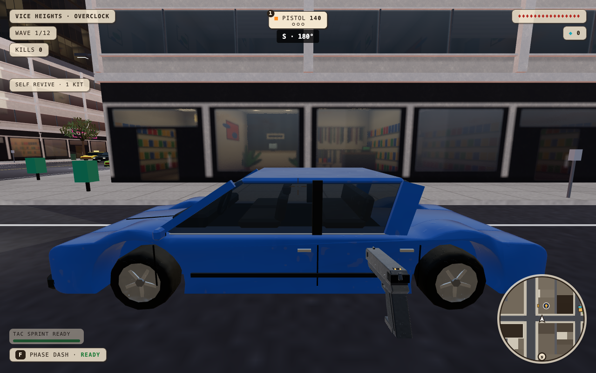
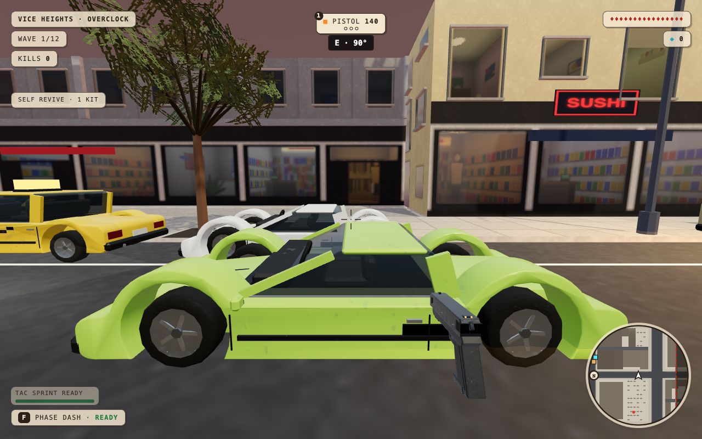
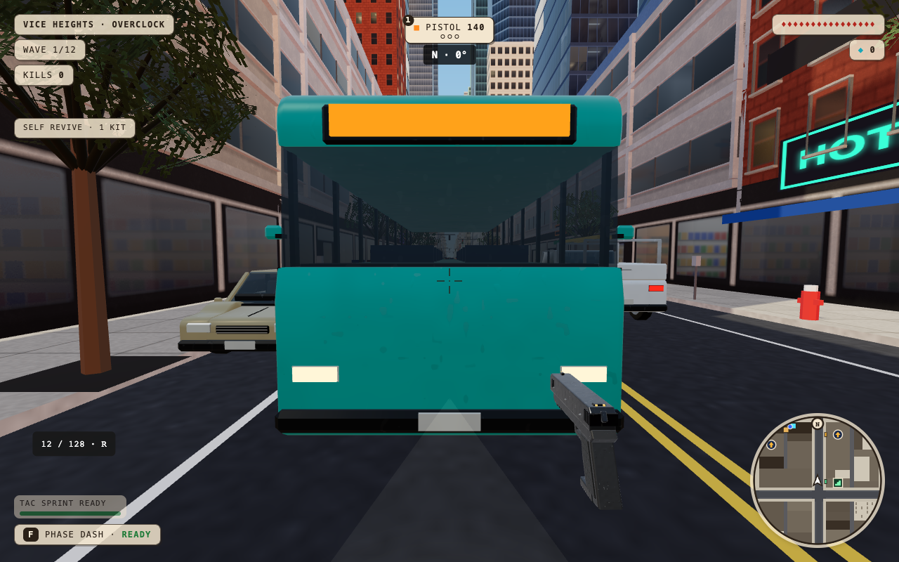
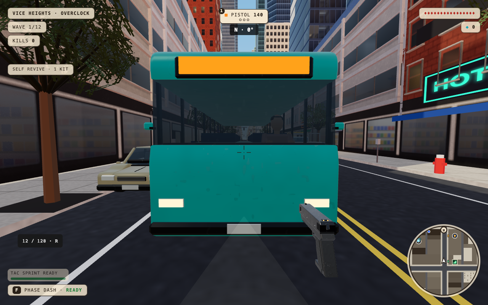
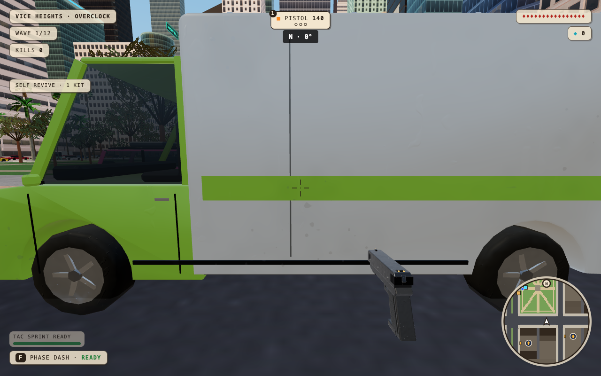
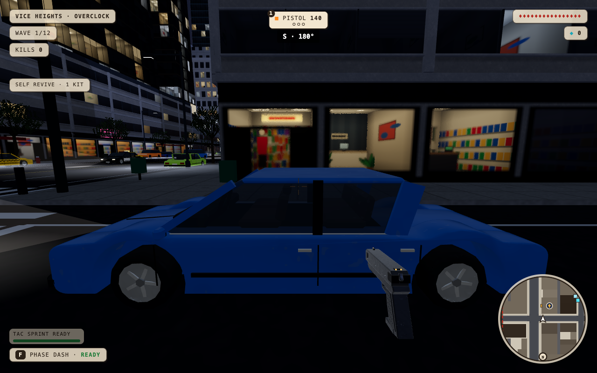
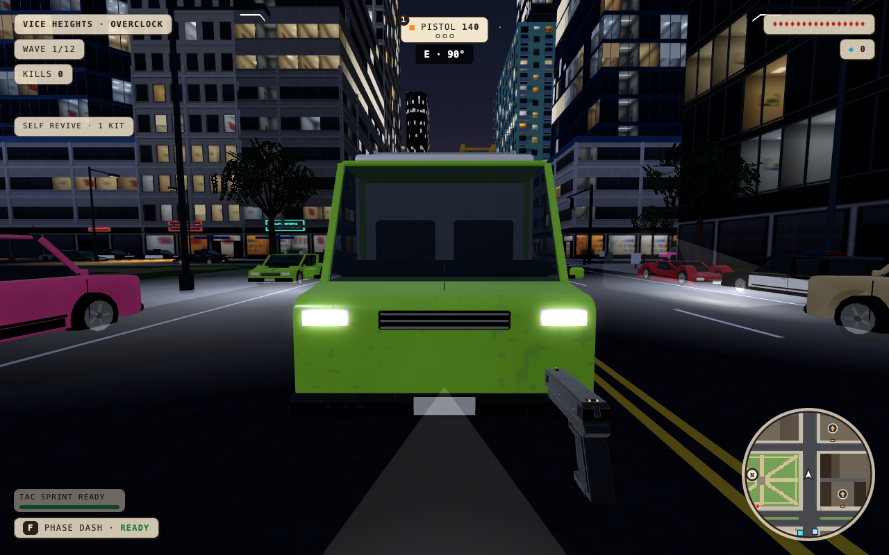
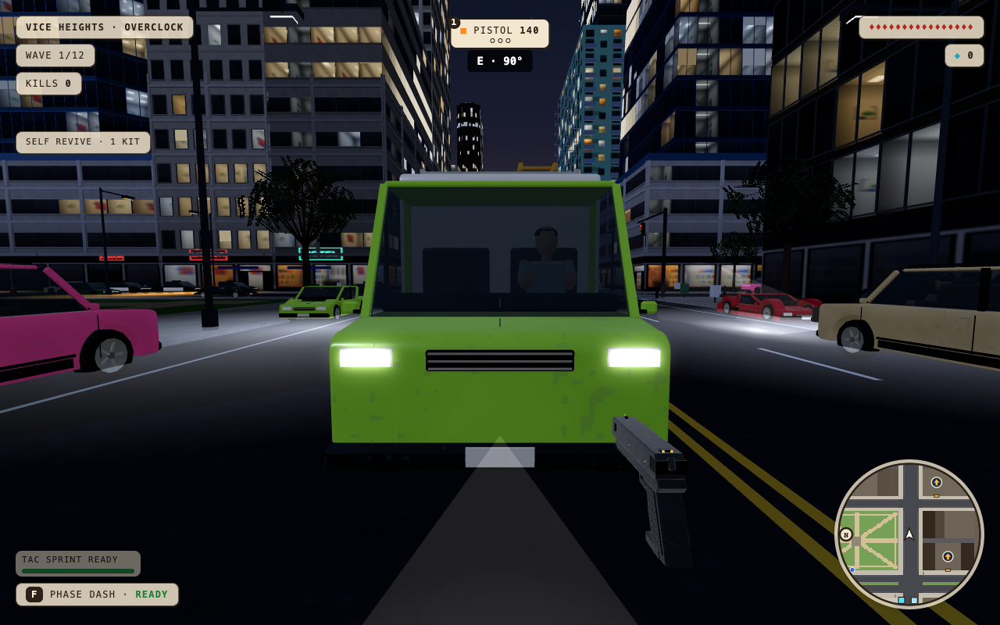

# Ambient vehicle driver art

The optional `driver` flag on `CarBatch.place` draws an original seated upper-body silhouette. One cached 348-triangle geometry and one shared instance batch serve every car type. Existing paint-mask material colors the shirt per vehicle; no texture, skeleton, NPC simulation or collision is added. Driver visibility distance follows the current quality tier: HIGH 45 m, MEDIUM 32 m, LOW 22 m. Parked callers default to empty; wrecks suppress occupants.

Cabin fitting lowers the concealed torso rather than compressing the head. The first prototype compressed sports-car figures vertically; independent review identified that risk and the placement was corrected before these captures.

## Diagnostic visual evidence

Current-production baseline 3cbda85 and isolated candidate were served from separate verified static builds. Chromium 151 used ANGLE Metal on the M4 Max, viewport 1280×800, DPR 1, HIGH, Vice seed 11, sunny sunset. All nine vehicle types were captured from front and side at 1.6 m player eye height. Traffic was frozen for matching camera poses. All 18 before/after camera pairs match; both runs have zero errors.

The candidate capture explicitly uses `DIAGNOSTIC_DRIVERS=1`: a temporary runtime getter enables the art before the gameplay-owned Traffic integration lands. This is visual evidence only. It does not establish car-entry behavior, co-op behavior or performance. The script and JSON record this override; it is not game code.

Independent review inspected all 18 candidate views and matched baselines for sedan, sports, bus and van. No roof, glass or exterior protrusion blocker was found. Seated silhouettes read through the glass, especially from the side and through bus/van windshields. Low sports roofs limit visibility; hands sit low relative to the wheel, so this is not evidence of anatomically accurate steering grip. The bus side view crops the driver end; the front view establishes its occupant.

| Empty sedan | Seated driver |
| --- | --- |
|  |  |

| Empty sports car | Driver under the low roof |
| --- | --- |
|  |  |

| Empty bus | Bus driver |
| --- | --- |
|  |  |

| Empty van | Van driver |
| --- | --- |
|  |  |

Full local captures are preserved in `output/playwright/drivers/`; representative pairs and full camera/error metadata are committed here. The full local suite passed 69/69 on the initial art commit; the revised placement passed all three focused geometry/occupancy/quality tests, typecheck and build. Final-head CI and independent review are separate gates.

## Night views

All 18 matched night camera pairs also passed independent visual review with no browser errors. Silhouettes are naturally dim through tinted glass; standard front views are faintest and the van front is clearer. The same diagnostic override is recorded. Full camera/error metadata is in `night-before.json` and `night-after.json`.

| Empty sedan at night | Seated driver at night |
| --- | --- |
|  |  |

| Empty van at night | Van driver at night |
| --- | --- |
|  |  |

## Traffic integration

The gameplay owner approved and released the Traffic hook: unclaimed ambient cars show a driver; local driving hides it; remote ownership shows it. Parked ambient cars, previously claimed empty cars and wrecks suppress it. The optional art flag still defaults false for other callers. Player-body hiding remains owned by the controller release and must be present before activation.

`activation.json` verifies the actual Traffic caller with no occupant override on Metal M4 Max: keyboard entry hides the driver, keyboard exit keeps the claimed car empty, an explicit parked fixture is empty, remote ownership shows the driver and remote exit removes it. A real ray-based `damageVehicle` call reduces the car to zero health and suppresses its driver. Browser errors are empty. Remote ownership is a direct state fixture here, not a two-peer co-op acceptance test.

The reviewed art/API commit `ce869ed` passed required CI, including 69 tests, typecheck, build, repository map and smoke. Eight additional local map/time smoke cases passed. The later Traffic hook passed typecheck, build, three focused tests and independent static review. Final integration-head checks and actual two-peer body cooperation remain pending. The first rendering comparison and its limitations are documented below. This document does not establish a production release or sustained frame rate.

## Controlled rendering comparison

Current main `e39d933` and candidate `82c3c66` were independently built and their served car-asset bytes verified. Four sequential runs alternated baseline/candidate at native speed, then baseline/candidate at 4× CPU throttle. Chromium 151 used actual ANGLE Metal on Apple M4 Max (Mac16,6, 14 CPU cores, 36 GB RAM, macOS 26.5.1), 1280×800 viewport, DPR 2, HIGH, Vice seed 11, sunny sunset. All traffic transforms and the car-facing camera matched exactly. Enemy poses were initially saved before spawning; the four later frozen enemies were not explicitly matched, so this first comparison has an uncontrolled enemy-position limitation. Four enemies were frozen; the candidate rendered one nearby occupant via the actual Traffic caller, without a driver override. Each fresh browser warmed for 10 seconds before a 20-second stationary measurement.

| Metric | Native baseline → candidate | 4× CPU baseline → candidate |
| --- | --- | --- |
| Frame p95 | 5.8 → 6.5 ms | 32.7 → 17.1 ms |
| Frame p99 | 6.5 → 7.3 ms | 34.7 → 32.7 ms |
| Worst frame | 38.0 → 20.9 ms | 118.4 → 153.8 ms |
| Frames over 25 / 50 ms | 2 / 0 → 0 / 0 | 98 / 2 → 43 / 2 |
| Render submission mean | 2.67 → 3.17 ms | 8.49 → 7.90 ms |
| GPU render-pass p95 | 4.50 → 6.08 ms | 3.66 → 3.53 ms |
| Draw calls mean | 278.07 → 279.04 | 278.09 → 278.96 |
| Triangles mean | 2,273,541 → 2,273,860 | 2,273,554 → 2,273,783 |
| Navigation through menu to scene | 2.98 → 2.87 s | 12.20 → 12.64 s |

The coordinated workers were idle, but this was not a quiet machine: Drive/iCloud/File Provider and other desktop processes were active. Their before/after CPU snapshots are summarized in `performance/background.json`. Native rendering has headroom in this view; the native candidate sample has higher submission/GPU time. The opposite direction under throttling and desktop activity prevent assigning those differences solely to the driver geometry. Both throttled builds have long stalls and p99 above the 16.7 ms target. No shader/program growth or measured shader/buffer call over 2 ms occurred during these warmed samples. First-use hitches, active combat endurance and sustained 60 fps remain unproven. Loading measurements are one sample per case, not cold OS-cache guarantees.

Reports and matched scene metadata are in `performance/`. Run `benchmark.mjs` with `MAPS=vice STATIONARY=1 SECONDS=20 REPEATS=1 WEATHER=sunny EXTRA='&time=sunset' QUALITY=high`, separate `BASE` URLs, explicit `COMMIT`, a common fresh `OUT`, and unique `TAG`; add `CPU_THROTTLE=4` for the throttled pair. Do not run concurrently with other benchmarks or builds.

## Controller integration co-op check

Local candidate `401fbfb` integrates reviewed controller head `1d0dad2` and its revive-main dependency. The two-peer run passed actual controller entry, host-authoritative steering/braking, enemy hull damage, ordinary exit, host transfer, rejoin and wreck ejection with zero page/console errors. Assertions compare the target seat matrix against rendered instance matrices, so another nearby car cannot satisfy the occupant check. The observing peer renders exactly one target occupant while both standing rigs are hidden; local driving renders no seated duplicate. Ordinary exit and wreck restore local/remote standing bodies and remove the seated target. After transfer, a newly joined observer sees one target occupant only after successful reentry and synchronized ownership.

Evidence is `coop-report.json`, `coop-remote-hidden.png` and `coop-remote-restored.png`. The successful rerun fixed a test readiness race by waiting for the rejoined page's vehicle state before positioning its observer. The reviewer-requested local ordinary-exit body assertion also passed against the captured report. These are local integration results, not production proof.
