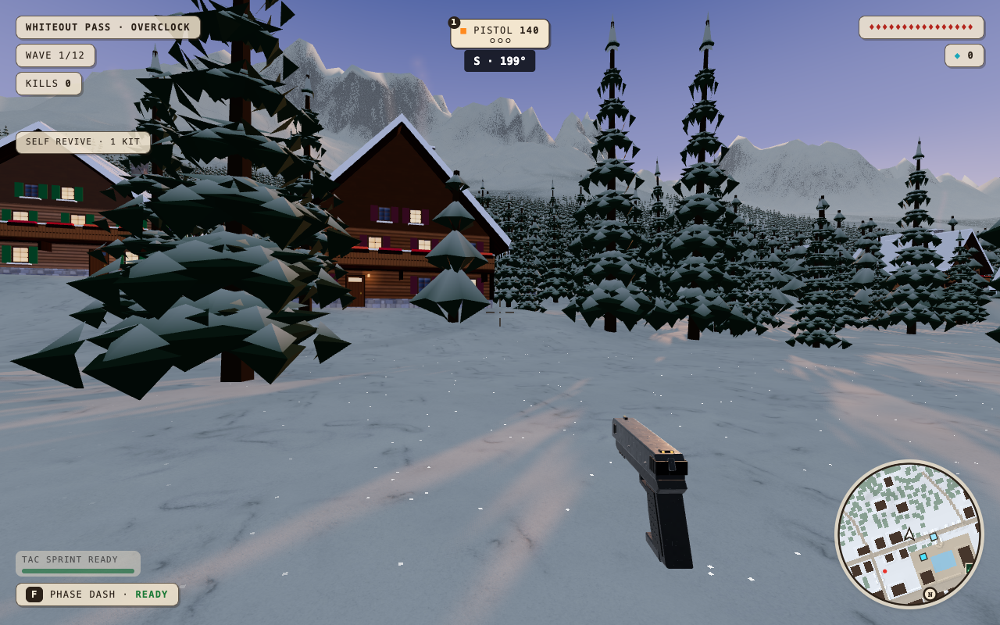
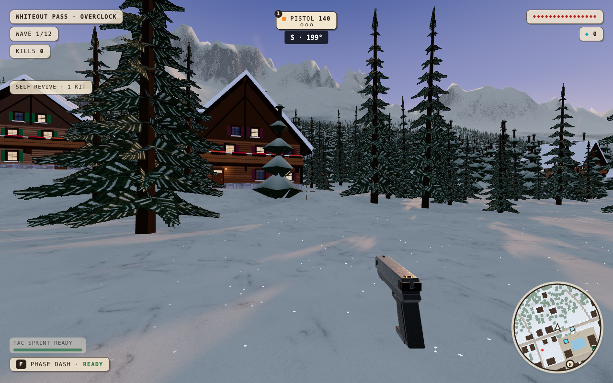
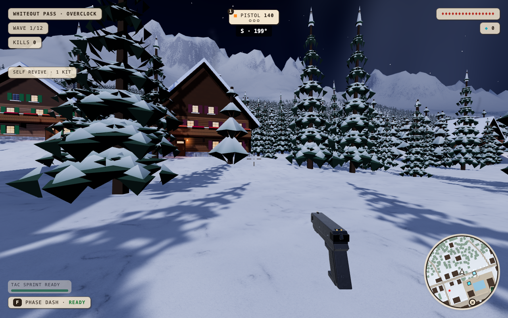
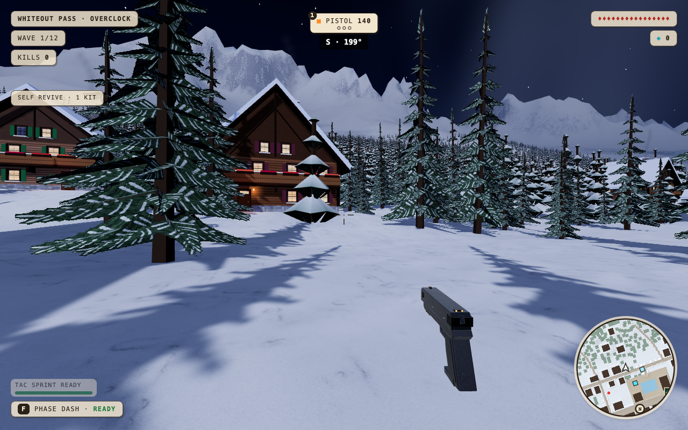

# Whiteout needle and chalet kit

This increment replaces near spruce’s solid snow shelves with an original procedural needle-and-snow atlas. Distant trees use solid overlapping boughs and a separate opaque material so mipmapping cannot erase the forest. New chalet window reveals, rafters and gable braces are non-colliding detail. Their geometry follows live graphics-tier changes.

Tree placement, trunk collision, playable structures and long enemy approaches are unchanged. World namespace v22 isolates the new geometry. Nuketown remains shelved. The traffic fix merged in c5972c4 is preserved.

## Acceptance record

- Independent review found a missing chalet quality-update hook; fixed before acceptance. All 13 detail geometries subsequently matched LOW and HIGH ranges across four live transitions, without replacing buffers or the scene.
- Actual keyboard W/A/S/D moved 7.21–7.85 m per two-second leg; Enter fired the weapon. Zero browser errors.
- Full local suite: 61 tests passed before the added foliage test; the final focused foliage suite passed all three tests. Current-head CI is required before merge.
- Typecheck, production build and repo-map pass. All eight map/time smoke cases pass with zero errors. Whiteout co-op host transfer preserves wave 5 and three enemies at HP 2/1/1. The rejoined guest reports its guest role and wave 5; its enemy HP was not separately recorded. Zero page errors occurred.
- Five matched player-eye poses in sunset and night (20 PNGs) use the same seeded cameras before/after. All captures have zero errors. Built and served Alpine asset hashes match their isolated source directories.

## Limits

This is a visual increment, not evidence of attaining a 60/100 realism score. The independent reviewer found meaningful near-tree improvement and modest chalet depth. Distant trees remain geometric and their LOD differs visibly from the near foliage. Earlier measured first-use shader/buffer hitches elsewhere are not fixed here. The preserved prewarm prototype is intentionally outside this PR.

## Controlled performance

MacBook Pro Mac16,6, Apple M4 Max (14 CPU cores), 36 GB, macOS 26.5.1; Chromium 151.0.7922.34 using ANGLE Metal (renderer recorded in each JSON). Viewport 1280×800, device scale factor 2, HIGH rendering at DPR 2. GPU vsync/frame cap disabled to measure headroom, not physical display FPS.

Order: current-main baseline native → candidate native → baseline 4× CPU → candidate 4× CPU. Baseline c5972c4, candidate source 2279a5d. Both are independently built static archives on separate localhost ports. Whiteout seed 11, sunset, identical stationary camera, three frozen diagnostic enemies, no movement/firing, 10-second warm-up and 20-second measurement. All recorded camera positions are identical within each run. This isolates the visual cost; it is not an active-combat endurance result.

| Metric | Before native | After native | Before CPU 4× | After CPU 4× |
| --- | ---: | ---: | ---: | ---: |
| Frame p95 (ms) | 5.7 | 5.7 | 9.3 | 10.1 |
| Frame p99 (ms) | 6.3 | 6.5 | 10.6 | 12.2 |
| Worst frame (ms) | 11.2 | 8.7 | 30.6 | 26.3 |
| Frames >25 ms | 0 | 0 | 3 | 1 |
| Frames >50 ms | 0 | 0 | 0 | 0 |
| Mean render submission CPU (ms) | 3.32 | 3.57 | 4.18 | 3.71 |
| Mean draw calls | 127.17 | 127.18 | 127.10 | 127.14 |
| GPU render-pass p95 (ms) | 5.60 | 5.81 | 3.72 | 4.19 |
| Navigation through menu to scene (ms) | 1693 | 1867 | 4296 | 4742 |

The candidate adds a small measured GPU cost and geometry (2.94M→3.10M submitted triangles across passes in this view), while CPU mean direction varies with throttling. Both samples retain p99 headroom under 16.7 ms; the short runs do not prove sustained hitch-free 60 fps or performance on other devices. The loading result is a local diagnostic including scripted menu entry, not a network latency guarantee. No loading/prewarm code changed.

Earlier moving-combat diagnostics were excluded from the controlled comparison because their routes diverged around obstacles. An earlier `tour=1` run was also excluded: that documented option is not implemented by the current game. Stationary mode explicitly freezes enemies and disables firing instead. The baseline measurement initially exited nonzero because the generic benchmark expected shots; its complete zero-error record was retained, and the assertion was corrected for stationary mode before the other runs.

## Matched images

The complete five-pose sets are in [images](images/), with camera and quality metadata in [evidence](evidence/). These are walkable player-eye positions selected by a fixed seed, including unflattering views.

| Sunset forest before | Sunset forest after |
| --- | --- |
|  |  |

| Night forest before | Night forest after |
| --- | --- |
|  |  |

The needle atlas is original procedural artwork generated by `spruceTexture` in `forest.ts`; no downloaded or paid asset is used. The existing shared material-source licenses remain unchanged.
